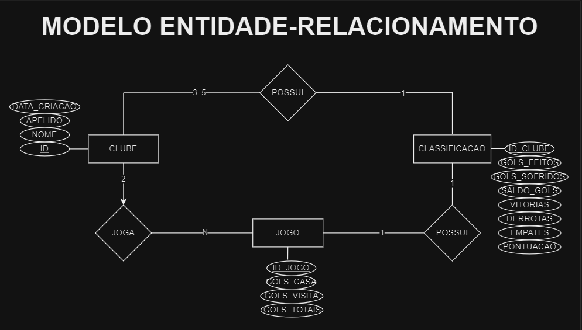
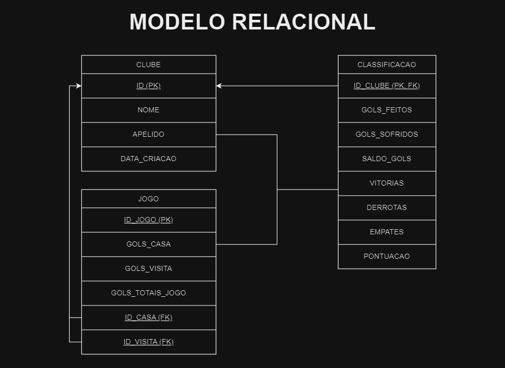

## 
TRABALHO 5BY5 - DB CAMPEONATO DE FUTEBOL 

## 
Sobre o projeto

### 
Um trabalho para praticar as ideias aprendidas no Módulo 2 de banco de dados da 5by5

## 
Tecnologias Utilizadas

- C#
- Sql Server

## 
Exercício Proposto

## 
Modelo Entidade-Relacionamento

## 
Modelo Relacional

## 
Feito por

- Gabriel Visicatto Soares
